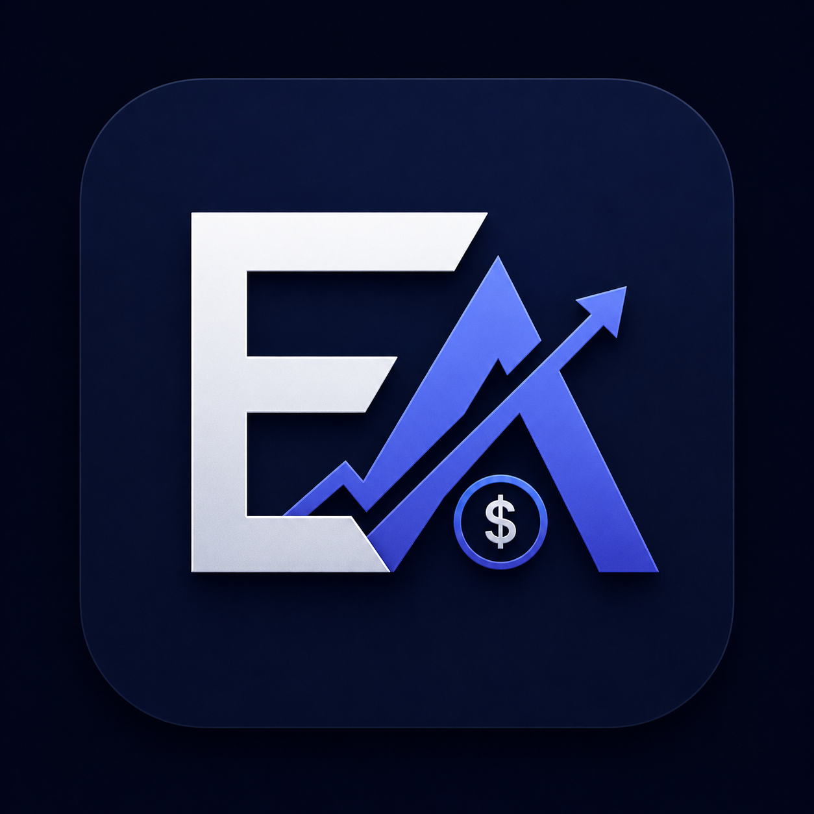

<div align="center">



# Controle Financeiro

Uma plataforma web moderna para organizar receitas, despesas, metas, cartões, limites, relatórios e acompanhar a evolução financeira de forma simples e visual.

[]()
[]()
[]()
[]()
[]()

</div>

---

## 📌 Sobre o Projeto

O **Controle Financeiro** é uma aplicação web desenvolvida para ajudar usuários a terem mais clareza sobre sua vida financeira.

A proposta do sistema é centralizar informações importantes como receitas, despesas, metas financeiras, limites por categoria, cartões, itens fixos e relatórios em um único painel simples, moderno e responsivo.

O projeto conta com autenticação de usuários e banco de dados online, permitindo que cada pessoa acesse somente suas próprias informações.

---

## 🌐 Acesse o Projeto

🔗 **Link do site:**  
https://controle-financeiro-ea.vercel.app

---

## ✨ Funcionalidades

### 👤 Acesso do Usuário

- Cadastro de usuários
- Login com e-mail e senha
- Recuperação de senha
- Sessão individual por usuário
- Dados separados por conta
- Botão de sair da conta

---

### 📊 Dashboard Financeiro

- Resumo mensal
- Total de receitas
- Total de despesas
- Saldo do mês
- Percentual de economia
- Insights automáticos
- Alertas visuais
- Comparação mensal
- Dashboard anual

---

### 💰 Lançamentos

- Cadastro de receitas
- Cadastro de despesas
- Edição de lançamentos
- Exclusão com confirmação
- Filtro por mês
- Filtro por tipo
- Filtro por categoria
- Busca por descrição
- Ordenação por data e valor

---

### 🎯 Metas Financeiras

- Criação de metas personalizadas
- Valor alvo
- Valor atual
- Progresso visual
- Acompanhamento da evolução
- Controle de objetivos como reserva, viagem, notebook ou quitação de dívidas

---

### 🚦 Limites por Categoria

- Definição de limite mensal por categoria
- Comparação entre valor gasto e limite definido
- Alerta ao ultrapassar o planejamento
- Melhor controle sobre gastos recorrentes

---

### 💳 Cartões de Crédito

- Cadastro de cartões
- Limite total
- Controle de limite usado
- Dia de fechamento
- Dia de vencimento
- Vinculação de despesas ao cartão

---

### 🔁 Receitas e Despesas Fixas

- Cadastro de itens recorrentes
- Receitas fixas
- Despesas fixas
- Geração automática de lançamentos do mês
- Organização de contas recorrentes como internet, academia, aluguel e salário

---

### 📅 Calendário Financeiro

- Visualização de vencimentos e movimentações
- Organização por data
- Acompanhamento de despesas futuras
- Visão mais clara da rotina financeira

---

### 📄 Relatórios e Exportação

- Exportação em CSV
- Relatório mensal
- Relatório anual
- Backup completo em JSON
- Importação de backup
- Análise por período, categoria e tipo

---

### ⚙️ Configurações

- Edição de perfil
- Nome do usuário dinâmico no painel
- Tema claro e escuro
- Configuração inicial da conta
- Exportação e limpeza de dados
- Preferências do usuário

---

## 🧪 Tecnologias Utilizadas

| Tecnologia | Uso no Projeto |
|---|---|
| **React** | Construção da interface |
| **Vite** | Ambiente de desenvolvimento e build |
| **JavaScript** | Lógica da aplicação |
| **Tailwind CSS** | Estilização e responsividade |
| **Supabase** | Banco de dados e autenticação |
| **PostgreSQL** | Banco relacional usado pelo Supabase |
| **Recharts** | Gráficos financeiros |
| **Lucide React** | Ícones da interface |
| **Framer Motion** | Animações |
| **Vercel** | Deploy da aplicação |

---

## 🖼️ Prévia do Projeto

> Adicione aqui um print da Home ou do Dashboard.

```md
